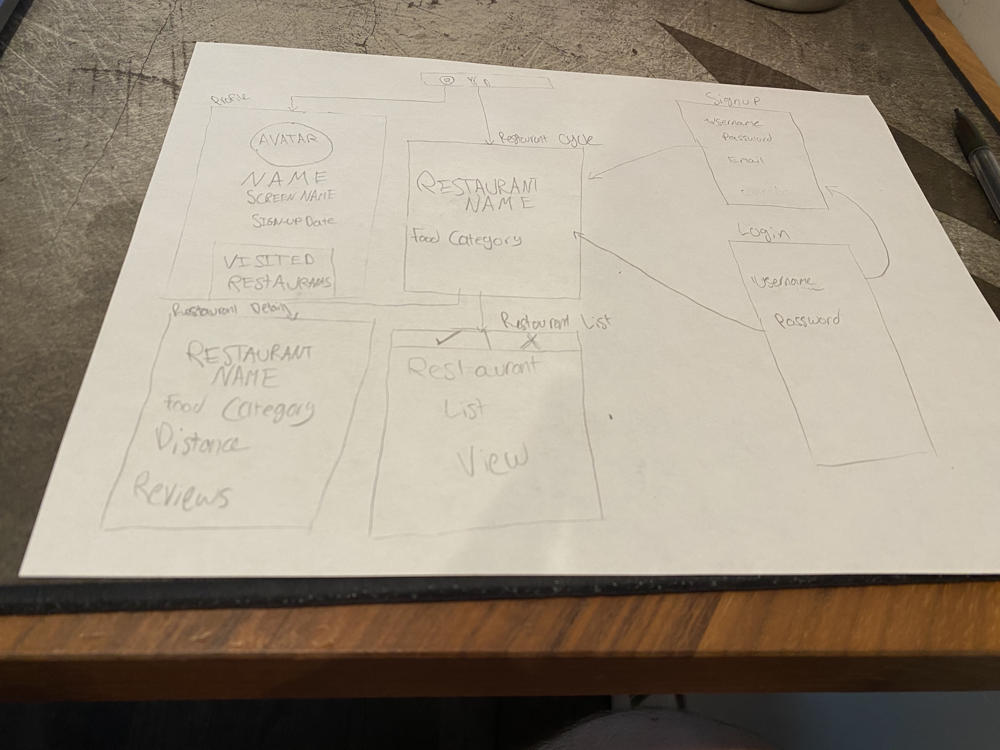

# FoodSwipe

## Table of Contents
1. [Overview](#Overview)
1. [Product Spec](#Product-Spec)
1. [Wireframes](#Wireframes)
2. [Schema](#Schema)

## Overview
### Description
FoodSwipe is a platform that allows a user to easily pick a restaurant they would like to eat at. Similar to Tinder, users can swipe left or right on random resaurants. At the end, the user can decide from the restaurants they swiped.

### App Evaluation
[Evaluation of your app across the following attributes]
- **Category:** Food & Drink
- **Mobile:** This app is mobile in the sense that it is meant to be used on the go. This allows users to quickly select a restaurant that they would like to go to. Moreover, it uses the users location to filter the available restaurants.
- **Story:** This app provides a very interactive and fun way to decide on a restaurant to attend. Instead of blandly looking at reviews, FoodSwipe provides a quick & easy method to decide.
- **Market:** This app could be for just about anyone. There is no bounds on who could have a use for the app.
- **Habit:** I would assume that a user would open this app at most a few times a week. In early versions, a user would simply consume content. However, in the future, users would be able to share restaurants they enjoy and publish lists of restaurants they have enjoyed for other users to browse and choose from. This would be similar to a music playlist found in Spotify or some other music streaming platform.
- **Scope:** The early versions of the app will be relatively easy to create as it will not allow for a lot of colloboration between users.

## Product Spec

### 1. User Stories (Required and Optional)

**Required Must-have Stories**

* Create several different views
    * Create a login page
    * Create a profile signup
    * Create a page to show a detailed view of a restaurant
    * Create a page to showcase a restaurant that allows users to accept or deny the restaurant
    * Create a page that allows a user to view all accepted/denied restaurants
* Cache restaurants that have been chosen to attend in a database
* Allow users to log in/log out of the app
* Allow users to signup with a new profile with basic information
    * Save user information in a database and generate a unique ID per user
* Allow users to easily navigate to the restaurant with the Google Maps SDK
* Allow users to filter the types of restaurants to choose from
* Allow users to easily swipe on a restaurant to accept/deny
* Animate the swiping as well as the accepting/denying of apps with bright colors
* Allow a user to take a picture to use as their avatar for their profile
* Incorporate the Material Design library

**Optional Nice-to-have Stories**

* Implement a group collaborative system that combines all accepted restaurants to be chosen from
* Allow a user to create and share a "Restaurant Playlist" which is a group of restaurants
    * Allow users to swipe left or right on a playlist specifically (only show restaurants in the playlist)
* Create several different views
    * Allow a user to view the profile of another user which showcases the restaurants they have been to and any pictures they have shared with their feed
    * Create a page that showcases all of the accepted restaurants from a group
    * Create a page to show case "Restaurant Playlists"
    * Create a page to allow for filter settings for restaurants to choose from
    * Create a page that showcases all pictures a user has taken on their profile
* Allow users to follow another user based on UID
* Allow users to take a picture of their restaurant and share it to their feed (this feed is local to the FoodSwipe app as opposed to sharing to Twitter
* Allow a user to decide how many restuarants need to be accepted before allowing the user to choose from their accepted restaurants
    * Allow a user to override this and skip to all accepted restaurants
* Allow a user to by default, share to their news feed the restaurant they have chosen
* Allow a user to login with Facebook
* Allow a user to see how many times a specific restaurant has been visited
   * Generate a Unique ID per restaurant

### 2. Screen Archetypes

* Login Screen
   * User can login
* Profile Signup Screen
   * User can create a new profile
* Restaurant Detail Screen
    * User can see detailed information about a given restaurant
* Accept/Deny Restaurant Cycle Screen
    * User can swipe left/right to accept/deny a restaurant
    * User can navigate to the detail screen to view more information
* Accepted/Denied Restaurants Screen
    * User can see a list of all accepted/denied restaurants for the current "session"
    * User can perform action on each individual restaurant such as navigate, and accept/deny after they have already swiped on the restaurant
* Pictures/News Feed Screen
    * User can view all of the pictures they have shared to their news feed

### 3. Navigation

**Tab Navigation** (Tab to Screen)

* Profile/News Feed
* Restaurant Cycle Screen

**Flow Navigation** (Screen to Screen)

* Login Screen
   => Restaurant Cycle Screen
* Restaurant Cycle Screen
   => Restaurant Details Screen
   or
   => Accepted/Denied Restaurants Screen

## Wireframes
[Add picture of your hand sketched wireframes in this section]

### [BONUS] Digital Wireframes & Mockups

### [BONUS] Interactive Prototype

## Schema 
[This section will be completed in Unit 9]
### Models
[Add table of models]
### Networking
- [Add list of network requests by screen ]
- [Create basic snippets for each Parse network request]
- [OPTIONAL: List endpoints if using existing API such as Yelp]
